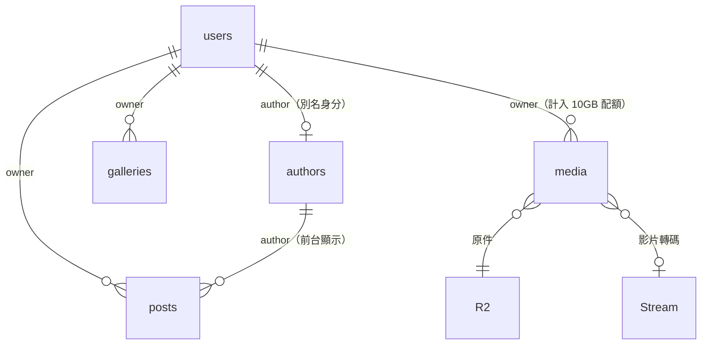

# 會員系統開發計劃（多作者投稿）

> 承接 [PLAN-payload.md](./PLAN-payload.md)。Payload CMS 遷移完成後，站點從「單人後台」擴充為「管理員邀請制的多作者平台」。

## 1. 需求

1. 管理員可用郵箱邀請他人成為**會員**
2. 會員登入後可編輯**自己的**文章
3. 會員可上傳圖片、影片 → 存 R2 → 轉碼後供前台使用
4. 每個會員可設定**別名**，在網站上顯示為作者
5. 普通會員**只能管理自己的內容**
6. 所有會員都能使用 AI 輔助寫作
7. 每個會員有 **10 GB** 圖片/影片容量上限

## 2. 已確認的產品決策

| 決策 | 選擇 |
|------|------|
| 邀請信寄送 | **Resend HTTP API**（Workers 不支援 SMTP），未設定或寄送失敗時後台直接顯示邀請連結供管理員手動傳送 |
| 會員後台可見範圍 | **自己的全部（含草稿）+ 別人已發布的**；只能編輯/刪除自己的 |
| 會員發布權限 | **可直接發布**，不需審核 |

## 3. 目標資料模型



**新增欄位**

| Collection | 欄位 | 說明 |
|-----------|------|------|
| `users` | `role` | `admin` \| `member`，預設 `member`，僅 admin 可改 |
| `users` | `author` | 關聯到 `authors`，該會員的別名身分 |
| `users` | `invitePending` / `invitedAt` / `invitedBy` | 邀請狀態 |
| `users` | `storageQuotaMb` | 選填，覆蓋預設 10240，僅 admin 可改 |
| `posts` / `galleries` / `media` / `authors` | `owner` | 關聯到 `users`，建立時自動填入，僅 admin 可改 |

## 4. 已驗證的技術前提

寫計劃時實際查過 `node_modules/payload` 原始碼，以下都成立：

- `payload.forgotPassword({ disableEmail: true, expiration })` **會回傳 token**（`auth/operations/forgotPassword.js:148`）→ 可組出邀請連結給管理員手動傳送，且能單獨為邀請延長有效期，不影響一般忘記密碼
- `EmailAdapter` 是一個純函式，只需回傳 `{ name, defaultFromAddress, defaultFromName, sendEmail }` → Resend adapter 約 20 行
- `upload.pasteURL: false` 可完全關閉「貼 URL 上傳」的伺服器端抓取（`uploads/types.d.ts:268`）
- Payload access control 的 `update` / `delete` 可回傳 Where query（而非只有 boolean），所以「只能改自己的」是一個查詢條件，不需在 hook 裡手動比對

## 5. 階段計劃

每階段的固定流程：

```
改 code → payload migrate:create → 本地 e2e 綠
       → CLOUDFLARE_ENV=staging pnpm payload migrate（remote D1）
       → CLOUDFLARE_ENV=staging build + deploy staging
       → PLAYWRIGHT_BASE_URL=<staging> pnpm test:e2e 綠
       → 手動驗收 → commit
```

> ⚠️ `CLOUDFLARE_ENV=staging` 必須顯式設定，`--env staging` 不會傳進 Next.js build 子行程（先前踩過）。

---

### M0 — 角色地基與權限收口 ✅ 已完成（`b6aed6e`、`8c716c3`）

本地 9/9、staging 9/9 通過；並用「把權限改回舊版寬鬆規則」的變異測試確認 M0-T3/T4/T5/T6 會失敗，證明負面測試有效。remote D1 已套用 `20260728_032809_add_user_roles`。

過程中發現並修掉一個獨立問題：設定 `serverURL` 會啟用 Payload 的 CSRF 檢查，導致不帶 `Origin`／`Sec-Fetch-Site` 的非瀏覽器客戶端（例如 Playwright 的 APIRequestContext）auth cookie 被忽略 —— 所有需要登入的 e2e 都靜默地以匿名身分執行。修正見 `a8b2a12`，瀏覽器不受影響（已對 staging 實測）。


**為什麼優先**：目前 `Users` 的 access 是 `Boolean(user)` — 任何登入者都能讀取、修改、刪除**任何**使用者，`Site` global 也是。第二個帳號一存在，這就是一個直接的提權漏洞。**在任何會員帳號建立之前必須先補上。**

**改動**
- 新增 `src/access/index.ts`：`isAdmin` / `isAdminOrSelf` / `isAdminFieldLevel` / `isOwner` / `ownedOrPublished`
- `Users`：加 `role` 欄位（`saveToJWT`，欄位級 create/update 限 admin）；access 改為 read/update = admin 全部、member 僅自己，delete = 僅 admin，create = 僅 admin（保留「第一個使用者自動成為 admin」的引導邏輯）
- `Site` global：`update` 改為僅 admin
- `Users.admin.hidden`：對 member 隱藏側邊欄入口（access 才是真正的門，hidden 只是介面整潔）

**遷移**：`add_user_roles`（`users.role` 欄位）；既有帳號回填為 `admin`

**驗證** `e2e/members/roles.spec.ts`
| ID | 案例 | 期望 |
|----|------|------|
| M0-T1 | 既有第一個帳號 | `role = admin` |
| M0-T2 | admin 建立 member 帳號 | 201 |
| M0-T3 | member PATCH 自己的 `role: admin` | role 不變 |
| M0-T4 | member GET `/api/users` | 只回自己一筆 |
| M0-T5 | member PATCH admin 的帳號 | 403/404 |
| M0-T6 | member POST `/api/globals/site` | 403 |
| M0-T7 | admin 原有操作 | 全部照舊（回歸） |

**完成標準**：e2e 綠 + staging 用 member 帳號登入 `/admin`，看不到 Users 列表、進得去 `/admin/account`

---

### M1 — 內容歸屬與隔離 ✅ 已完成（`031ce6a`）

本地 8/8、staging 8/8；變異測試確認 M1-T3/T4/T6 在舊的寬鬆規則下會失敗。remote D1 已套用 `20260728_042531_add_content_owner`，回填後 21 篇文章 / 24 相簿 / 418 media / 全部 authors 皆有 owner，無 NULL。

實作上 owner 防護做了兩層：欄位級 access 在 `beforeValidate` 剝掉偽造的 `owner`，`setOwner` hook 再於 `beforeChange` 蓋上真正的擁有者（已確認 Payload 的執行順序是 beforeValidate 先於 beforeChange，所以兩者不衝突）。

回填放進 migration 而非獨立腳本，這樣每個環境都會自動執行、且與 schema 變更同一個交易單位。


**改動**
- `posts` / `galleries` / `media` / `authors` 各加 `owner`（relationship → users，`index: true`，欄位級寫入限 admin）
- `src/collections/hooks/owner.ts`：`setOwner` beforeChange — 建立時填入 `req.user.id`，更新時不覆蓋
- access 規則：

  | | 匿名 | member | admin |
  |---|---|---|---|
  | read (posts/galleries) | 僅 published | 自己的 ∪ published | 全部 |
  | read (media) | 全部（前台需要） | 全部 | 全部 |
  | create | ✗ | ✓ | ✓ |
  | update / delete | ✗ | `owner = 自己` | 全部 |

- `scripts/backfill-owner.ts`：把既有 15 篇文章 / 20 個相簿 / 413 筆 media 的 `owner` 補成管理員帳號（冪等，只補 NULL）

**遷移**：`add_content_owner`（4 個 owner 欄位 + index）

**驗證** `e2e/members/ownership.spec.ts`
| ID | 案例 | 期望 |
|----|------|------|
| M1-T1 | member 建文章 | `owner` 自動 = 自己 |
| M1-T2 | member 送出 `owner: 別人` | 被忽略，仍是自己 |
| M1-T3 | member PATCH 別人的文章 | 403 |
| M1-T4 | member DELETE 別人的 media | 403 |
| M1-T5 | member GET `/api/posts` | 含自己草稿 + 別人已發布，**不含別人草稿** |
| M1-T6 | 匿名 GET `/api/posts` | 只有已發布（回歸） |
| M1-T7 | backfill 後公開站頁面 | 舊內容正常渲染（回歸） |

---

### M2 — 邀請流程

**設計**：不自己造 token 機制，直接複用 Payload 內建的 reset-password token（已驗證可取得 token）。

1. admin POST `/api/members/invite` `{ email, displayName? }`
2. email 已存在 → 409
3. 建立 user：隨機 32 bytes 密碼、`role: member`、`invitePending: true`
4. `forgotPassword({ disableEmail: true, expiration: 7天 })` 取得 token
5. 組出 `<serverURL>/admin/reset/<token>`
6. Resend 有設定 → 寄信，回 `{ sent: true }`；否則 → 回 `{ sent: false, inviteLink }`
7. 受邀者首次登入時（`afterLogin` hook）清除 `invitePending`

**改動**
- `src/lib/email.ts`：Resend EmailAdapter
- `src/endpoints/inviteMember.ts`：邀請端點（僅 admin）
- `Users.auth.forgotPassword.generateEmailHTML/Subject`：依 `invitePending` 切換「邀請你加入野馬營」/「重設密碼」文案
- `src/components/admin/InviteMemberPanel.tsx`：掛在 Users list 上方，送出後顯示結果與可複製的兜底連結

**驗證** `e2e/members/invite.spec.ts`
| ID | 案例 | 期望 |
|----|------|------|
| M2-T1 | 未登入呼叫邀請 | 401 |
| M2-T2 | member 呼叫邀請 | 403 |
| M2-T3 | admin 邀請新 email | 201，users 多一筆 member/invitePending |
| M2-T4 | admin 邀請重複 email | 409，不建立第二筆 |
| M2-T5 | 用連結的 token 設密碼 | 成功，之後能用新密碼登入 |
| M2-T6 | 設定密碼並登入後 | `invitePending` 已清除 |
| M2-T7 | 亂改/過期的 token | 400 |

**手動驗收**：後台按「邀請會員」→ 取得連結 → 無痕視窗開啟 → 設密碼 → 登入成功

> Resend 網域驗證需要在 `wildrunner.org` 加 DNS 記錄（你有權限）。**這步可以延後，不阻塞其他階段** — 兜底連結讓整套流程在 staging 完全可驗。

---

### M3 — 別名（作者身分）

**改動**
- `Users.hooks.afterChange`（create）：自動建立一筆 `authors`，`name = displayName ?? email 的 @ 前段`，`slug` 自動去重，`owner` = 該使用者，並回填 `users.author`
- `Posts.author`：`defaultValue` = 目前使用者的 author；欄位級 update 對 member 關閉（不能把文章掛到別人名下），admin 可改
- 會員改別名 = 改自己那筆 `authors.name`（M1 的 owner access 已保證只能改自己的）

**設計取捨**：`authors.slug` 一旦建立就**不隨 name 變動**，避免公開連結斷掉；顯示名稱可隨時改。前台已經是讀 `posts.author → authors.name`，**不需要改動任何前台程式碼**。

**驗證** `e2e/members/alias.spec.ts`
| ID | 案例 | 期望 |
|----|------|------|
| M3-T1 | 邀請建立的會員 | 自動有一筆 author，owner 正確 |
| M3-T2 | 兩個同名會員 | slug 自動去重，不衝突 |
| M3-T3 | member 改自己/別人的 author | 自己成功、別人 403 |
| M3-T4 | member 建文章 | `author` 自動 = 自己的別名 |
| M3-T5 | member 改 `post.author` 為別人 | 被忽略 |
| M3-T6 | 改別名後前台文章頁 | 顯示新別名（revalidate 生效） |

---

### M4 — 10 GB 配額

**設計**：不用計數器（會漂移），每次上傳直接對 D1 下一條 indexed 聚合查詢：

```sql
SELECT COALESCE(SUM(filesize), 0) FROM media WHERE owner_id = ?
```

刪除自動釋放空間，不需額外邏輯。

**改動**
- `src/lib/quota.ts`：`getUsedBytes(userId)` / `getQuotaBytes(user)`（`users.storageQuotaMb` → `MEMBER_STORAGE_QUOTA_MB` → 10240）
- `src/collections/hooks/quota.ts`：Media `beforeOperation`(create) — `used + req.file.size > quota` → `APIError(413)`；admin 不受限
- `Media.upload.pasteURL: false` — 一石三鳥：擋掉會員讓 Worker 去 fetch 任意 URL 的 SSRF、堵住繞過配額的路徑、順便永久關閉當初造成 media 重複的那條 code path
- 單檔上限（建議 200 MB），同時作為 Worker request body 限制的護欄
- `src/endpoints/storageUsage.ts` + `src/components/admin/StorageQuotaField.tsx`：後台顯示「已用 x.x GB / 10 GB」

**驗證** `e2e/members/quota.spec.ts`
| ID | 案例 | 期望 |
|----|------|------|
| M4-T1 | 未登入查用量 | 401 |
| M4-T2 | member 上傳圖片 | usedBytes 增加 ≈ 檔案大小 |
| M4-T3 | member 刪除該圖 | usedBytes 歸位 **且 R2 物件真的消失** |
| M4-T4 | quota 調成 1 MB 後上傳 2 MB | 413，且**不留孤兒 media 記錄、不留孤兒 R2 物件** |
| M4-T5 | 超額後刪檔再上傳 | 成功 |
| M4-T6 | admin 上傳 | 不受配額限制 |
| M4-T7 | 貼 URL 上傳 | 被拒 |

> M4-T3 特別重要：如果 D1 記錄刪了但 R2 物件還在，配額就會越算越不準，而且是靜默的。

---

### M5 — 媒體管線（會員上傳的圖/影片必須在前台顯示）⚠️ 最不確定

這階段正面解掉兩個先前掛著的已知問題 —— 會員上傳後看不到東西的話，前面全白做。

**已知問題**
1. 新上傳的 media，`url` 是 `/api/media/file/<filename>` 相對路徑，`next/image` 經 IMAGES binding 優化時對自己發請求會失敗。遷移進來的舊資料是 R2 絕對 URL，所以之前沒踩到。
2. Stream ingest 需要能公開 fetch 到影片來源，新上傳的相對路徑要靠 `NEXT_PUBLIC_SITE_URL` 組絕對 URL，加上 `global_fetch_strictly_public` flag，需實測。

**方案**：給 `r2Storage` 設 `generateFileURL`，讓新上傳的 media 直接產生 R2 公開網域的絕對 URL（`https://images.wildrunner.org/<key>`）—— 與遷移進來的舊資料格式一致，一次解決 1 和 2。

**檔名衝突（資料損毀風險）**：兩個會員各上傳一張 `IMG_1234.jpg` 會不會互相覆蓋？**必須實測**。建議直接加 per-user 前綴 `<userId>/<uuid>-<原檔名>`，同時讓 R2 裡一眼看得出檔案屬於誰。

**驗證** `e2e/members/media-pipeline.spec.ts`
| ID | 案例 | 期望 |
|----|------|------|
| M5-T1 | member 上傳圖片 | `media.url` 是絕對 CDN URL |
| M5-T2 | 該圖用於文章 | 前台 `/_next/image` 優化成功（非退回原圖） |
| M5-T3 | 兩會員上傳同名檔 | 兩個不同 R2 key，互不覆蓋 |
| M5-T4 | member 上傳短影片 | `streamId` 有值、`streamReady` 最終 true、前台可播放 |
| M5-T5 | 上傳 .txt / .pdf | 被拒（回歸） |
| M5-T6 | 舊的遷移內容 | 圖片仍正常（回歸） |

**手動驗收**：上傳一支 50–100 MB 的影片，確認沒撞到 Workers request body 上限

---

### M6 — 會員 AI

現有 `/api/ai/expand-post` 只檢查 `req.user`，會員本來就能用，這階段以驗證為主。

**改動**：限流 key 從 `${user.id}:${ip}` 改為純 `user.id` —— 目前換 IP 就能重置額度

**驗證**
| ID | 案例 | 期望 |
|----|------|------|
| M6-T1 | member 呼叫 AI | 200 且回傳真實中文段落（非原樣回吐 = 模型沒回應） |
| M6-T2 | 超過限流 | 429，換 IP/UA 無法繞過 |
| M6-T3 | AI 產文存草稿 | `owner` 正確 |
| M6-T4 | 未登入 | 401（回歸） |

---

### M7 — 全量回歸與上線

1. 舊的 P0–P5 + 新的 M0–M6 全套 e2e 對 staging 跑綠
2. **端到端手動走一遍**：邀請你的第二個信箱 → 收信/取連結 → 設密碼 → 登入 → 改別名 → 上傳圖 → 寫文章 → 用 AI → 發布 → 前台看到 → 配額數字正確 → 確認改不了別人的東西
3. **安全複查（逐條打勾）**：member 不能改 role、不能改別人內容、不能改 Site、不能看別人草稿、不能貼 URL 上傳、不能超配額
4. `wrangler d1 export --remote` 備份
5. 合併到 `main` → production 部署 → 建立真實 admin 帳號 → **刪除測試帳號**（`admin@wildrunner.test`、`member@wildrunner.test`、`member2@wildrunner.test` — e2e 直接跑在 staging 共用的 D1 上，會留下這些帳號）
6. 確認 production 建置的 `NEXT_PUBLIC_SITE_URL` 是 `https://wildrunner.org` —— 它同時決定 Payload 的 CSRF 允許來源，設錯會讓後台所有寫入被靜默拒絕

## 6. 風險

| 風險 | 說明 | 緩解 |
|------|------|------|
| **權限收口漏一處** | Payload 的 access 有 collection / field / global 三層，任一層漏掉就整個破功 | M0/M1 的 e2e 全是負面測試逐條打；M7 有獨立安全複查 |
| **同名檔案互相覆蓋** | 多人上傳 `IMG_1234.jpg` → 靜默資料損毀 | M5-T3 明確驗；建議直接加 per-user 檔名前綴 |
| **大影片撞 Worker body 上限** | 100–500 MB 視方案而定 | M5 實測；真撞到就改 Stream direct creator upload（瀏覽器直傳 Stream，不經 Worker） |
| **R2 物件沒跟著刪** | 配額越算越不準，且靜默 | M4-T3 直接驗 R2 |
| Resend 網域驗證要動 DNS | 需要你在 Cloudflare 加記錄 | 兜底連結讓功能不阻塞，DNS 隨時可補 |
| 邀請連結外洩 = 帳號被奪 | token 是進入後台的鑰匙 | 7 天到期、一次性；兜底連結只回給 admin |
| **D1 read replica 延遲** | 本次 session 已多次遇到，寫完不一定立刻讀得到 | 新程式不假設讀寫立即一致；e2e 加重試 |
| 每個欄位都要一支 D1 migration | `push: false`，schema 改動不會自動同步 | 每階段獨立 migration，本地 → staging remote → production 三段式 |

## 7. 新增環境變數

| 變數 | 用途 |
|------|------|
| `RESEND_API_KEY` | 邀請信；未設定則走手動連結兜底 |
| `RESEND_FROM` | 寄件人，例如 `野馬營 <noreply@wildrunner.org>` |
| `NEXT_PUBLIC_MEDIA_BASE_URL` | R2 公開網域，M5 用來產生絕對 media URL |
| `MEMBER_STORAGE_QUOTA_MB` | 預設 `10240`，可被 `users.storageQuotaMb` 覆蓋 |

## 8. 粗估工作量

| 階段 | 估時 | 依賴 |
|------|------|------|
| M0 角色與權限收口 | 0.5 天 | — |
| M1 內容歸屬 | 1 天 | M0 |
| M2 邀請流程 | 1 天 | M0 |
| M3 別名 | 0.5 天 | M1、M2 |
| M4 配額 | 1 天 | M1 |
| M5 媒體管線 | 1–2 天（最不確定） | M1 |
| M6 會員 AI | 0.5 天 | M0 |
| M7 回歸與上線 | 0.5 天 | 全部 |

M0 → M1 是硬依賴且是安全地基，必須先做完。M2 和 M4/M5 之後可並行。
