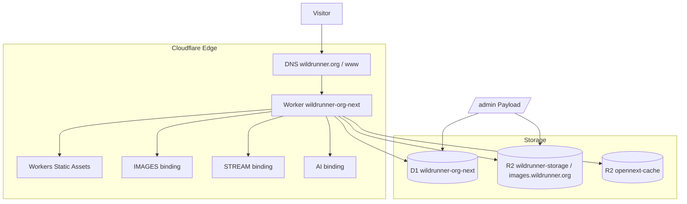

> **Historical.** Kept for the reasoning, not as a live specification.
>
> The `X-Tn` identifiers here were once traceability into the test suite.
> They no longer are: 162 of the 211 IDs the specs use appear in no plan
> at all, because the form outlived the practice. Do not read a test's ID
> as a reference to a numbered requirement.
>
> What the suite is for, and what it should contain, is
> `docs/testing-strategy.md` and `docs/testing-plan.md`.

# Payload CMS 迁移计划（`feat/payload-cms-migration`）

> 本文档取代 [PLAN.md](./PLAN.md) 中已归档的 Phase 0–3 之后的后续工作。

## 1. 背景与目标

[PLAN.md](./PLAN.md) 完成的迁移把站点从 Docker/Traefik 搬到了 Cloudflare Workers + OpenNext，内容管线仍是 **Velite + MDX**，明确排除 D1/CMS。

该架构在实际使用中暴露出内容运营的痛点（发文/建相册必须改仓库、走构建），因此本分支转向：

- **Payload CMS 3** 作为编辑后台（`/admin`），内容存 **Cloudflare D1**
- 媒体原件存 **R2**，图片经 `IMAGES` binding 优化，视频经 **Cloudflare Stream**
- **Workers AI** 提供文章 AI 辅助（`AI` binding）
- Velite/MDX 降级为「一次性迁移数据源」，不再参与生产构建

这与 PLAN.md 第 130 行「不引入 D1/KV/第三方 CMS」的原则相反 — 是有意识的架构变更，非误操作。

## 2. 目标架构

Bindings（见 [wrangler.jsonc](./wrangler.jsonc)）：`D1`、`R2`、`NEXT_INC_CACHE_R2_BUCKET`、`IMAGES`、`STREAM`、`AI`、`ASSETS`、`WORKER_SELF_REFERENCE`。

## 3. 阶段清单与当前进度

阶段编号取自 e2e 测试标签（`P{n}-T{m}`），是当前最权威的进度依据 — 测试文件存在只代表用例已写，需要实际跑 `pnpm test:e2e` 确认通过。

| Phase | 内容 | 覆盖测试 | 状态 |
|-------|------|---------|------|
| **P0** | 脚手架：分支、bindings（D1/R2/AI/IMAGES/STREAM）、受保护 collection 未鉴权拒绝 | `e2e/scaffold.spec.ts`, `e2e/smoke.spec.ts` | ✅ 已提交（`e30726d`） |
| **P1** | Schema（Authors/Galleries/Media/Posts/Users/Site）、Auth/Access、媒体上传+建相册、Site hero 编辑 | `e2e/admin-auth.spec.ts`, `e2e/access.spec.ts`, `e2e/admin/media-gallery.spec.ts` | 🟡 schema+auth 已提交（`0a8bfcf`）；媒体上传/hero 测试**未提交**（工作区新增） |
| **P2** | 发布可见性（draft 隐藏/published 可见）、列表+首页 revalidate、`/og`、移动端无错误 | `e2e/public/posts.spec.ts`, `e2e/public/revalidate.spec.ts` | 🟠 实现+测试均在工作区，**未提交** |
| **P3** | Velite → Payload 迁移脚本（dry-run 计数校验、LFS 跳过文档） | `scripts/migrate-velite-to-payload.ts`, `e2e/scaffold.spec.ts` (`P3-T1`/`P3-T8`) | 🟠 脚本已写，**未提交**；尚未确认是否已在生产 D1 跑过 remote 导入 |
| **P4** | AI 辅助写作 API + Admin UI（鉴权、空 body 400、限流、错误态保留文本） | `e2e/ai/expand-post.spec.ts`, `src/endpoints/aiExpandPost.ts` | 🟠 已实现，**未提交** |
| **P5** | 相册媒体：非法类型拒绝、slug 去重、Stream 视频接入 | `e2e/media/gallery-stream.spec.ts`, `e2e/media/images.spec.ts` | 🟠 已实现，**未提交** |

**未提交文件**（`git status`，共 69 项改动）覆盖了 P1 剩余部分到 P5 的全部实现：`src/collections/hooks/`、`src/endpoints/`、`src/lib/stream*.ts`、`src/lib/cf-image.ts`、`src/components/admin/`、`scripts/assert-bindings.mjs`、`scripts/assert-no-lfs-in-builds.mjs`、新 D1 migration `20260727_142704_add_media_stream_gallery_fields`。

**下一步建议**：先跑 `pnpm test:e2e` 确认工作区改动全部通过，再分阶段提交（例如按 P1 尾部 → P2 → P3 → P4 → P5 拆分 commit），避免一次性大合并掩盖问题。

## 4. Cutover Checklist（生产切流前，摘自 [docs/payload-migration.md](docs/payload-migration.md)）

1. 跑一次 `pnpm migrate:velite:remote`，检查 `reports/payload-migration.json`
2. 确认 Stream 待处理队列为空，或已记录后续重试计划
3. Workers Builds 构建命令切到 `pnpm payload migrate && opennextjs-cloudflare build`（见 [docs/workers-builds.md](docs/workers-builds.md)）
4. Playwright 全绿后，将 `feat/payload-cms-migration` 合并到 `main`
5. Velite 脚本只保留为离线工具；确认公开站点代码不再 `import '#site/content'`

## 5. 环境变量新增（相对 PLAN.md 第 6 节）

| 变量 | 用途 |
|------|------|
| `PAYLOAD_SECRET` | Payload CMS，必需 |
| `NEXT_PUBLIC_CF_STREAM_CUSTOMER_CODE` | 可选，自定义 Stream 播放域 |
| `S3_*` | 降级为仅本机 Velite 处理用，不再进入 Workers Builds |

## 6. 风险

| 风险 | 缓解 |
|------|------|
| Payload D1 schema 迁移在生产执行失败/中途中断 | 部署前 `wrangler d1 export --remote` 备份；`docs/workers-builds.md` 已列回滚步骤 |
| Velite → Payload 迁移非幂等导致重复内容 | 脚本按 slug 跳过已存在项（见 `migrate:velite:remote` 说明），需在合并前实测验证 |
| 69 个未提交文件一次性合并，难以追责 | 建议按阶段拆分提交并逐段跑 e2e |
| AI 辅助写作误发布 / 限流失效 | `e2e/ai/expand-post.spec.ts` 已覆盖限流与鉴权，合并前需保证绿 |
| Stream 视频处理中的可见性（无 R2 mp4 兜底） | 已在 `docs/payload-migration.md` 记录为已知设计，非 bug |

## 7. 回滚

- Cloudflare Dashboard → Workers → Deployments 回滚到上一版本（见 [docs/workers-builds.md](docs/workers-builds.md)）
- D1 用部署前导出的 SQL 备份还原
- 分支未合并前，`main` 仍是纯 Velite/OpenNext 版本，可直接放弃本分支回退
