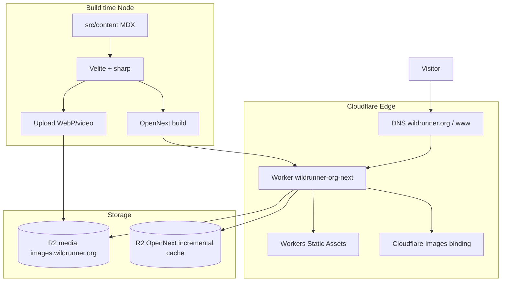

# wildrunner.org-next

野馬營（Wild Runner）跑步博客 — 基于 **Cloudflare Workers + OpenNext** 的生产站点。

| 项 | 值 |
|----|-----|
| 生产站点 | https://wildrunner.org · https://www.wildrunner.org |
| Worker | `wildrunner-org-next` |
| 媒体 CDN | https://images.wildrunner.org（R2） |
| 仓库 | https://github.com/jackywxd/wildrunner.org-next |
| 旧站（Docker/Traefik） | [`wildrunner.org`](https://github.com/jackywxd/wildrunner.org)（已切流，可只读保留） |

线上检查（2026-07-20）：apex / www 首页、文章、相册、`/og`、字体均返回 **200**，响应头含 `x-opennext: 1`。

---

## 架构



### 运行时（Workers）

- **Next.js 15 App Router** 经 [@opennextjs/cloudflare](https://opennext.js.org/cloudflare) 打包为 Worker
- **Workers Static Assets**：JS/CSS/字体等静态资源
- **路由**：`wildrunner.org/*`、`www.wildrunner.org/*`（zone routes，见 `wrangler.jsonc`）
- **图片优化**：`IMAGES` binding（Cloudflare Images）
- **ISR/增量缓存**：R2 bucket `wildrunner-org-next-opennext-cache`
- **动态能力**：`/og`（Open Graph 图）；其余页面多为 SSG
- **分析**：可选 Cloudflare Web Analytics（`NEXT_PUBLIC_CF_WEB_ANALYTICS_TOKEN`）

### 构建时（Node ≥ 22）

- **Velite**：MDX → `.velite/*.json`；`src/content` 内本地图/视频经 sharp/HEIC → WebP 后上传 R2
- **日常 `pnpm build`** 不跑 Velite（使用已有 `.velite`）；内容或媒体变更时执行 `pnpm content`
- **媒体**：图片/视频与 MDX 同仓管理，经 **Git LFS** 跟踪（见 `.gitattributes`）

### 不包含

数据库、鉴权、Server Actions、Cron、Docker、Traefik、PostHog。

---

## 技术栈

| 层 | 技术 |
|----|------|
| 框架 | Next.js 15 · React 19 · TypeScript |
| 边缘运行时 | Cloudflare Workers · OpenNext · Wrangler |
| 内容 | Velite · MDX · remark/rehype · Shiki |
| 样式 | Tailwind CSS 3 · shadcn/ui |
| 媒体 | Cloudflare R2 · sharp（仅构建期） |
| 包管理 | pnpm 10 · Node.js ≥ 22 |

---

## 目录结构（要点）

```
wildrunner.org-next/
├── src/app/           # 页面：/ posts gallery about og
├── src/components/    # UI、MDX、相册、Analytics
├── src/content/       # MDX/JSON + 原始图片/视频（Git LFS）
├── src/lib/           # veliteUtils（R2/sharp）等
├── public/fonts/      # OG 字体（Workers Assets）
├── .velite/            # Velite 生成物（本地/CI，gitignore）
├── wrangler.jsonc     # Worker 名、routes、R2、Images
├── open-next.config.ts
├── velite.config.ts
├── docs/workers-builds.md
└── PLAN.md            # 迁移计划与阶段记录
```

---

## 本地开发

```bash
nvm use 24          # 或任意 Node ≥ 22
pnpm install
cp .env.example .env.local   # 填入 R2 与站点 URL
git lfs pull                 # 拉取 content 媒体（约 1.4GB）

pnpm content                 # 内容/媒体变更后：重建 .velite 并上传 R2
pnpm dev                     # http://localhost:3000
pnpm preview                 # 本地 workerd
pnpm deploy                  # 部署到 Cloudflare Workers
```

### 常用脚本

| 命令 | 作用 |
|------|------|
| `pnpm dev` | 本地 Next 开发 |
| `pnpm content` | 仅 Velite（图处理 + R2 上传） |
| `pnpm build` | `next build`（需已有 `.velite`） |
| `pnpm build:content` | Velite + Next |
| `pnpm preview` | OpenNext 构建 + 本地 wrangler 预览 |
| `pnpm deploy` | OpenNext 构建并部署到 Cloudflare |

### 环境变量

见 [`.env.example`](./.env.example)：

| 变量 | 用途 |
|------|------|
| `NEXT_PUBLIC_SITE_URL` | 站点绝对 URL（OG/元数据） |
| `NEXT_PUBLIC_CF_WEB_ANALYTICS_TOKEN` | 可选 Web Analytics |
| `R2_PUBLIC_URL` | 媒体公开基址 |
| `S3_*` | R2 S3 API（仅 `pnpm content` 需要） |

---

## 部署

### 手动（本机）

```bash
nvm use 24
export NEXT_PUBLIC_SITE_URL=https://wildrunner.org
export NEXT_PUBLIC_ENV=production
export R2_PUBLIC_URL=https://images.wildrunner.org
# 如需重建内容，另设 S3_* 后执行 pnpm content
pnpm deploy
```

Worker 配置见 [`wrangler.jsonc`](./wrangler.jsonc)：

- 名称：`wildrunner-org-next`
- Routes：`wildrunner.org/*`、`www.wildrunner.org/*`
- R2 cache：`wildrunner-org-next-opennext-cache`
- Bindings：`ASSETS`、`IMAGES`、`NEXT_INC_CACHE_R2_BUCKET`、`WORKER_SELF_REFERENCE`
- Observability：已开启

### CI（Workers Builds）

将 GitHub 仓库接到 Cloudflare Workers Builds。构建命令、密钥清单见 [docs/workers-builds.md](./docs/workers-builds.md)。

### DNS

域名已在 Cloudflare zone `wildrunner.org` 上，流量经 **Workers Routes** 进入本 Worker（橙色云代理）。媒体子域 `images.wildrunner.org` 指向 R2 公开访问。

---

## 主要路由

| 路径 | 说明 |
|------|------|
| `/` | 首页：口号、最新文章、精选相册 |
| `/posts`、`/posts/[...slug]` | 文章列表 / MDX 详情 |
| `/gallery`、`/gallery/[slug]` | 相册 |
| `/about` | 关于 |
| `/og?title=` | 动态 OG 图 |

---

## 相关文档

- [PLAN.md](./PLAN.md) — 迁移审计与分阶段记录
- [docs/workers-builds.md](./docs/workers-builds.md) — Workers Builds 配置清单
