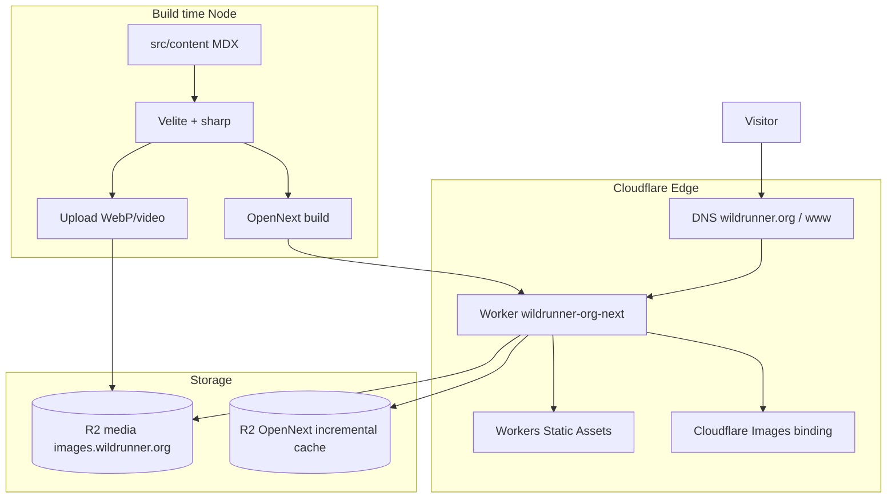

# wildrunner.org-next

野馬營（Wild Runner）跑步博客 — 基于 **Cloudflare Workers + OpenNext** 的生产站点。

| 项 | 值 |
|----|-----|
| 生产站点 | https://wildrunner.org · https://www.wildrunner.org |
| Worker | `wildrunner-org-next` |
| 媒体 CDN | https://images.wildrunner.org（R2） |
| 仓库 | https://github.com/jackywxd/wildrunner.org-next |
| 旧站（Docker/Traefik） | [`wildrunner.org`](https://github.com/jackywxd/wildrunner.org)（已切流，可只读保留） |

线上检查（2026-07-20）：apex / www 首页、文章、相册、`/og`、字体均返回 **200**，响应头含 `x-opennext: 1`。

---

## 架构



### 运行时（Workers）

- **Next.js 15 App Router** 经 [@opennextjs/cloudflare](https://opennext.js.org/cloudflare) 打包为 Worker
- **Payload CMS 3**：编辑后台 `/admin`，内容存 **D1**，媒体原件存 **R2**
- **图片优化**：`IMAGES` binding + `next/image`
- **视频**：Cloudflare **Stream**（`STREAM` binding）
- **AI**：Workers AI（`AI` binding）辅助写作
- **ISR/增量缓存**：R2 bucket `wildrunner-org-next-opennext-cache`

### 构建时

- 生产 `pnpm build` / Workers Builds：**不跑 Velite**
- 内容迁移：`pnpm migrate:velite`（从已提交的 `.velite` JSON 导入 Payload）
- 日常发文/建相册：Payload Admin

> 分支 `feat/payload-cms-migration` 完成切流前，请以 [`docs/payload-migration.md`](docs/payload-migration.md) 为准。

---

## 技术栈

| 层 | 技术 |
|----|------|
| 框架 | Next.js 15 · React 19 · TypeScript |
| 边缘运行时 | Cloudflare Workers · OpenNext · Wrangler |
| 内容 | Velite · MDX · remark/rehype · Shiki |
| 样式 | Tailwind CSS 3 · shadcn/ui |
| 媒体 | Cloudflare R2 · sharp（仅构建期） |
| 包管理 | pnpm 10 · Node.js ≥ 22 |

---

## 目录结构（要点）

```
wildrunner.org-next/
├── src/app/           # 页面：/ posts gallery riders races about og、/admin、/members
├── src/collections/   # Payload collections（Posts/Galleries/Media/RaceRecords/RaceSchedule…）
├── src/components/    # UI、MDX、相册、赛事日程、Analytics
├── src/content/       # MDX/JSON + 原始图片/视频（Git LFS）
├── src/lib/races/     # 赛事目录（代码内）、徽章、月历与报名状态推导
├── src/lib/           # content（站点数据层）、veliteUtils（R2/sharp）等
├── src/migrations/    # D1 schema migrations（push:false，必须手写/生成）
├── public/fonts/      # OG 字体（Workers Assets）
├── .velite/            # Velite 生成物（纳入 Git；CI 不重跑 Velite）
├── wrangler.jsonc     # Worker 名、routes、R2、Images
├── open-next.config.ts
├── velite.config.ts
├── docs/               # workers-builds、race-schedule、release-pipeline…
└── PLAN.md            # 迁移计划与阶段记录
```

---

## 本地开发（Payload）

```bash
nvm use 24
pnpm install
cp .env.example .env.local   # 必填 PAYLOAD_SECRET
cp .dev.vars.example .dev.vars

pnpm payload migrate
pnpm migrate:velite:dry
pnpm migrate:velite           # 可选：把 `.velite` 导入本地 D1/R2
pnpm dev                     # http://localhost:3000 与 /admin
pnpm test:e2e
```

内容日常在 `/admin` 管理。Velite/`pnpm content` 仅作历史迁移工具，详见 [`docs/payload-migration.md`](docs/payload-migration.md)。

### 常用脚本

| 命令 | 作用 |
|------|------|
| `pnpm dev` | Next + Payload Admin |
| `pnpm payload migrate` | 应用 D1 schema migrations |
| `pnpm migrate:velite` | 幂等导入 `.velite` → Payload |
| `pnpm seed:races:dry` / `pnpm seed:races` | 赛事日程种子数据（幂等；`:dry` 只校验并打印核对清单） |
| `pnpm test:e2e` | Playwright 门禁 |
| `pnpm assert:bindings` | 校验 wrangler D1/R2/AI/IMAGES/STREAM |
| `pnpm preview` / `pnpm deploy` | OpenNext 预览 / 部署 |

### 环境变量

见 [`.env.example`](./.env.example)：

| 变量 | 用途 |
|------|------|
| `PAYLOAD_SECRET` | Payload CMS（必需） |
| `NEXT_PUBLIC_SITE_URL` | 站点绝对 URL（OG/元数据） |
| `NEXT_PUBLIC_CF_WEB_ANALYTICS_TOKEN` | 可选 Web Analytics |
| `NEXT_PUBLIC_CF_STREAM_CUSTOMER_CODE` | 可选 Stream 客户域 |
| `R2_PUBLIC_URL` | 媒体公开基址 |
| `RACE_MAINTENANCE_SECRET` | 可选。赛事日程每日维护端点的鉴权；**须用 `wrangler secret put`**，不可打进 bundle。不设则仅该端点拒绝，站点本身不受影响 |
| `S3_*` | 仅遗留 Velite 本机处理 |

---

## 部署

### 手动（本机）

```bash
nvm use 24
export NEXT_PUBLIC_SITE_URL=https://wildrunner.org
export NEXT_PUBLIC_ENV=production
export R2_PUBLIC_URL=https://images.wildrunner.org
pnpm payload migrate
pnpm deploy
```

Worker 配置见 [`wrangler.jsonc`](./wrangler.jsonc)：

- 名称：`wildrunner-org-next`
- Routes：`wildrunner.org/*`、`www.wildrunner.org/*`
- Bindings：`D1`、`R2`、`IMAGES`、`STREAM`、`AI`、`ASSETS`、`NEXT_INC_CACHE_R2_BUCKET`

### CI（Workers Builds）

push `main` 自动部署。**不跑 Velite、不拉 Git LFS**。Build 含 `pnpm payload migrate` + OpenNext。清单见 [docs/workers-builds.md](./docs/workers-builds.md)。

### DNS

域名在 Cloudflare zone `wildrunner.org`，流量经 **Workers Routes** 进入本 Worker。媒体子域 `images.wildrunner.org` 指向 R2。

---

## 主要路由

| 路径 | 说明 |
|------|------|
| `/` | 首页：口号、最新文章、近期赛事、精选相册 |
| `/posts`、`/posts/[...slug]` | 文章列表 / Lexical 详情 |
| `/gallery`、`/gallery/[slug]` | 相册 |
| `/gallery/[slug]/v/[videoId]` | Stream 视频页 |
| `/riders`、`/riders/[slug]` | 成员名录 / 个人页（含完赛徽章） |
| `/races` | 赛事日程：未来一年，列表 / 月历两种视图 |
| `/members/*` | 会员后台（文章、媒体、比赛纪录） |
| `/admin` | Payload CMS |
| `/about`、`/og` | 关于 / OG 图 |

## 文档

- [`docs/payload-migration.md`](docs/payload-migration.md)
- [`docs/payload-testing.md`](docs/payload-testing.md)
- [`docs/race-schedule.md`](docs/race-schedule.md) — 赛事日程：数据模型、报名状态推导、种子数据与每日维护
- [`docs/workers-builds.md`](docs/workers-builds.md)

---

## 相关文档

- [PLAN.md](./PLAN.md) — 迁移审计与分阶段记录
- [docs/workers-builds.md](./docs/workers-builds.md) — Workers Builds 配置清单
